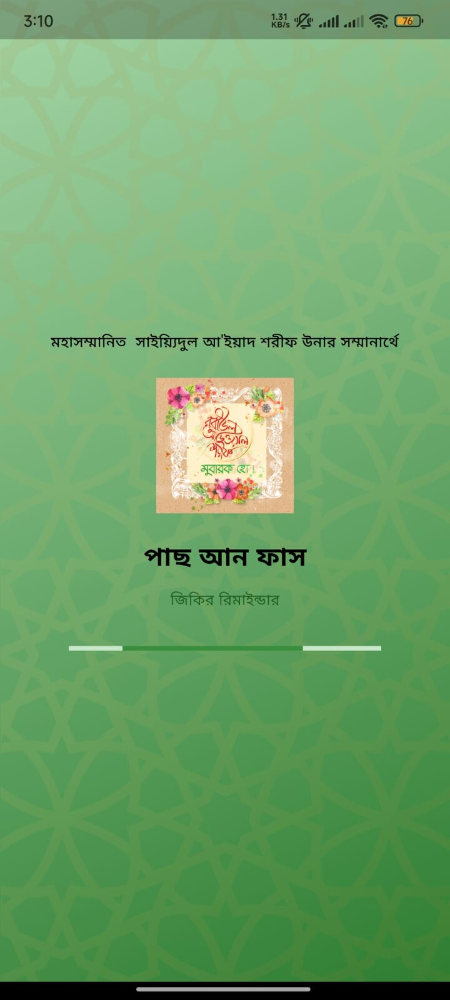
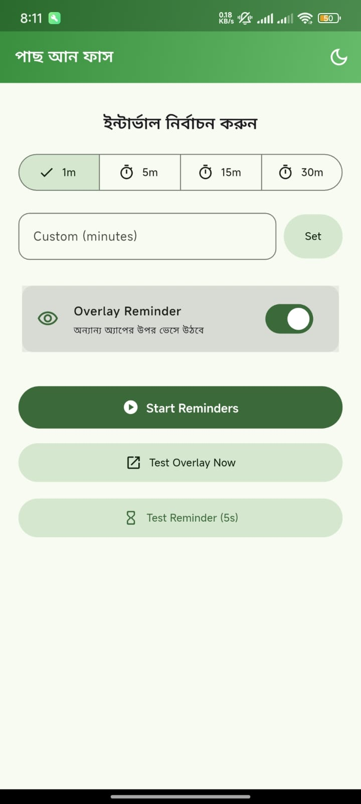
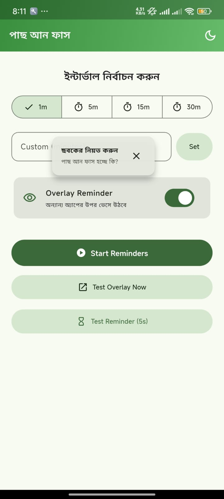

<!-- ──────────────────────────────────────────────────────────────── -->
<!-- 🕌 পাছ আন ফাস (Pas-An-Fas) -->
<!-- ──────────────────────────────────────────────────────────────── -->

<h1 align="center">🕌 পাছ আন ফাস (Pas-An-Fas)</h1>

<p align="center">
  
  
  
  
</p>

<p align="center">
  
  
  
  
</p>

---

<p align="center">
  <b>পাছ আন ফাস</b> is a modern Islamic Zikir Reminder App built with Flutter.<br>
  It helps you stay mindful of your daily Zikir through elegant notifications and floating overlays.<br><br>
  🌙 <i>“Remember Allah often, that you may succeed.” – (AL-Qur’an Shareef 62:10)</i> 🌿
</p>

---

## 🌟 Features

- ✅ **Custom Interval Reminders:** 1, 5, 15, 30 minutes or your custom interval  
- ✅ **Floating Overlay Reminder:** Shows Zikir above other apps (draggable & resizable)  
- ✅ **Local Notifications:** Never miss your Zikir  
- ✅ **Dark/Light Mode:** User-friendly theme switch  
- ✅ **Beautiful UI:** Islamic-themed design with smooth animations  
- ✅ **Shared Preferences:** Saves your preferred settings automatically  

---

## 📲 Screenshots & Demo

<p align="center">
  
  
  
</p>


---

## ⚡ Installation

Clone the repository:

```bash
git clone https://github.com/ReXiOP/PasAnFas.git
cd PasAnFas
```

Install dependencies:

```bash
flutter pub get
```

Run the app:

```bash
flutter run
```

Build the release APK:

```bash
flutter build apk --release
```

---

## 📥 Download APK

👉 [**Download Latest Pas-An-Fas APK**](https://github.com/ReXiOP/PasAnFas/releases/latest/download/PasAnFas.apk)


---

## 🧭 Usage
1. Give **Notification** permission
1. Choose a reminder interval (1/5/15/30/custom).  
2. Enable **floating overlay** to show reminders above other apps.  
3. Start the Zikir reminder service and stay connected with your faith.  

> ⚠️ Overlay requires **“Draw over other apps”** permission from system settings.

---

## 👨‍💻 Developer

**Muhammad Sajid**  
🌏 Bangladesh  
💻 GitHub: [@ReXiOP](https://github.com/ReXiOP)  
📧 Email: [dev.sajid09@gmail.com](mailto:dev.sajid09@gmail.com)

> Passionate Flutter Developer | Building meaningful Islamic mobile experiences 💫

---

## 📜 License

This project is licensed under the **MIT License** — see the [LICENSE](LICENSE) file for details.

---

## 💬 Feedback & Contributions

Contributions, issues, and feature requests are welcome!  
If you love this project, consider giving it a ⭐ on GitHub. 🌟

---

<p align="center">
  
</p>

<h3 align="center"> Thank You for Visiting!</h3>
<p align="center">
  <i>May "পাছ আন ফাস" help you remember Allah frequently and bring peace to your heart.</i> 🌿
</p>

---
